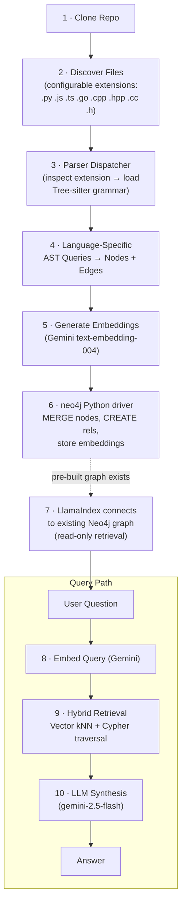
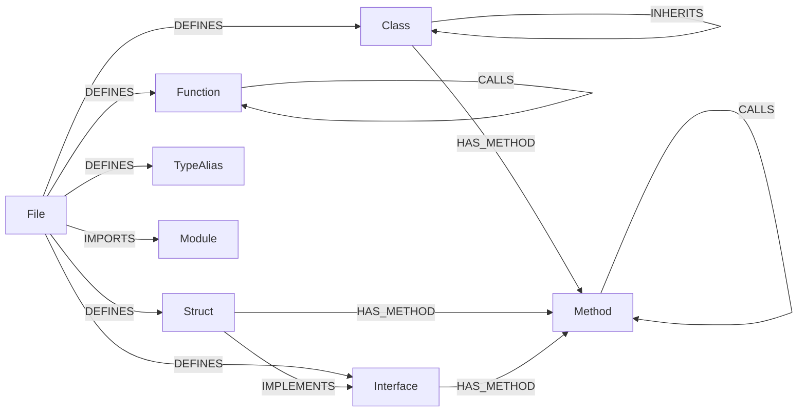
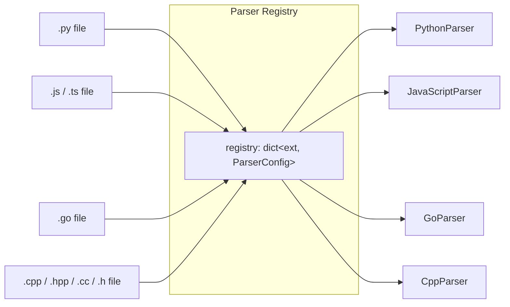

# GraphRAG Codebase Explorer — Implementation Plan (v3)

> **Revision notes:** Multi-language parser dispatcher (Python, JS/TS, Go, **C++**), generalized schema for non-OOP paradigms (Go structs, TS interfaces, **C++ namespaces**), and explicit separation of ingestion (neo4j driver) from retrieval (LlamaIndex).

---

## 1. Workflow Diagram



### Ingestion vs. Retrieval — Separation of Concerns

| Concern | Tool | Role |
|---------|------|------|
| **Graph Construction** (Steps 1–6) | `neo4j` Python driver | We manually build every node, relationship, and embedding property via Cypher `MERGE`/`CREATE` statements. Full control over schema. |
| **Graph Retrieval** (Steps 7–10) | LlamaIndex `Neo4jPropertyGraphStore` | Connects to the **pre-existing** Neo4j graph. Configured as a read-only retriever — it does **not** build or modify the graph. |

> [!IMPORTANT]
> LlamaIndex never touches ingestion. It is wired to Neo4j strictly for hybrid retrieval (vector similarity + Cypher graph traversal) and LLM synthesis.

---

## 2. Graph Schema

### Node Labels

| Label | Languages | Key Properties | Description |
|-------|-----------|---------------|-------------|
| `File` | All | `path`, `name`, `language`, `embedding` | A source file |
| `Class` | Python, JS/TS, C++ | `name`, `file_path`, `lineno`, `docstring`, `embedding` | Class definition |
| `Function` | All | `name`, `file_path`, `lineno`, `docstring`, `signature`, `embedding` | Top-level function |
| `Method` | All (class/struct receivers) | `name`, `parent_name`, `file_path`, `lineno`, `docstring`, `signature`, `embedding` | Method bound to a class/struct/interface |
| `Struct` | Go, TS, C++ | `name`, `file_path`, `lineno`, `docstring`, `embedding` | Go `type X struct{}` / TS structural types / C++ `struct X {}` |
| `Interface` | Go, TS | `name`, `file_path`, `lineno`, `docstring`, `embedding` | Go `type X interface{}` / TS `interface X {}` |
| `TypeAlias` | Go, TS, C++ | `name`, `file_path`, `lineno`, `target_type`, `embedding` | `type ID = string` / Go `type X = Y` / C++ `using X = Y` |
| `Module` | All | `name` | An imported external module/package. **C++ `namespace` maps here** — a namespace is the organizational unit analogous to a module/package. |

#### Mapping non-OOP constructs to the schema

| Language Construct | Node Label | Rationale |
|--------------------|-----------|-----------|
| Go `struct` | `Struct` | Distinct from Class; no inheritance |
| Go `interface` | `Interface` | Behavioral contract, not a class |
| Go methods (receiver fns) | `Method` with `parent_name` = struct name | Struct acts as the "parent" |
| TS `interface` | `Interface` | Same semantics as Go interfaces |
| TS `type X = ...` | `TypeAlias` | Not instantiable; purely a type mapping |
| TS `class` | `Class` | Directly maps |
| C++ `class` | `Class` | Directly maps |
| C++ `struct` | `Struct` | Struct semantics (public-by-default); distinct from Class |
| C++ `namespace` | `Module` | Organizational unit; analogous to packages/modules |
| C++ methods | `Method` with `parent_name` = class/struct name | Member functions |
| C++ free functions | `Function` | Top-level / namespace-scoped functions |
| C++ `using X = Y` / `typedef` | `TypeAlias` | Type alias constructs |

### Edge Types

| Type | Source → Target | Description |
|------|----------------|-------------|
| `DEFINES` | File → Class / Function / Struct / Interface / TypeAlias | File defines a top-level symbol |
| `HAS_METHOD` | Class / Struct / Interface → Method | Parent contains a method |
| `CALLS` | Function / Method → Function / Method | One callable invokes another |
| `IMPORTS` | File → Module | File imports a module/package |
| `INHERITS` | Class → Class | Python/JS/TS/C++ class inheritance |
| `IMPLEMENTS` | Struct → Interface | Go implicit or TS explicit `implements` |
| `CONTAINS` | File → File | Directory containment (optional) |

### Visual Schema



---

## 3. Multi-Language Parser Dispatcher

### Architecture



Each `ParserConfig` encapsulates:
- The Tree-sitter `Language` object (loaded from the grammar package)
- A set of **language-specific AST queries** (Tree-sitter S-expression queries for classes, functions, calls, imports, etc.)
- A mapping function that converts raw AST captures into our unified `NodeData`/`EdgeData` models

**Extension → Grammar mapping (configurable in `config.py`):**

| Extension(s) | Grammar Package | Parser Class |
|-------------|----------------|--------------|
| `.py` | `tree-sitter-python` | `PythonParser` |
| `.js`, `.ts` | `tree-sitter-javascript`, `tree-sitter-typescript` | `JavaScriptParser` |
| `.go` | `tree-sitter-go` | `GoParser` |
| `.cpp`, `.hpp`, `.cc`, `.h` | `tree-sitter-cpp` | `CppParser` |

The dispatcher loads grammars **lazily** — only the grammars needed for extensions found in the repo are imported.

---

## 4. Module Breakdown

```
GraphRAG/
├── docker-compose.yml              # Neo4j container
├── .env.example                    # API keys / DB creds template
├── requirements.txt                # Pinned dependencies
├── config.py                       # Settings, language registry config
├── graph_schema.py                 # Pydantic models: NodeData, EdgeData
├── parsers/
│   ├── __init__.py                 # Parser base class + registry/dispatcher
│   ├── python_parser.py            # Python AST queries
│   ├── javascript_parser.py        # JS/TS AST queries
│   ├── go_parser.py                # Go AST queries
│   └── cpp_parser.py               # C++ AST queries
├── embeddings.py                   # Gemini embedding helper (batch + rate-limit)
├── ingest.py                       # clone → discover → dispatch parse → embed → Neo4j
├── query_engine.py                 # LlamaIndex PropertyGraph hybrid retriever (read-only)
├── main.py                         # CLI: ingest / query sub-commands
└── tests/
    ├── test_python_parser.py       # Python AST extraction tests
    ├── test_js_parser.py           # JS/TS AST extraction tests
    ├── test_go_parser.py           # Go AST extraction tests
    ├── test_cpp_parser.py          # C++ AST extraction tests
    └── test_query_engine.py        # Integration smoke test
```

| File | Responsibility |
|------|---------------|
| `config.py` | Loads `.env`; exposes `NEO4J_URI`, `GEMINI_API_KEY`, model names; defines `LANGUAGE_REGISTRY` mapping extensions → grammar + parser class |
| `graph_schema.py` | Pydantic dataclasses: `NodeData(label, properties)`, `EdgeData(type, source_id, target_id)` — language-agnostic |
| `parsers/__init__.py` | `BaseParser` ABC with `parse(source: bytes) → (list[NodeData], list[EdgeData])`; `ParserDispatcher.get_parser(ext)` factory |
| `parsers/python_parser.py` | Tree-sitter queries for `class_definition`, `function_definition`, `call`, `import_statement` |
| `parsers/javascript_parser.py` | Queries for `class_declaration`, `function_declaration`, `arrow_function`, `call_expression`, `import_statement`, `interface_declaration`, `type_alias_declaration` |
| `parsers/go_parser.py` | Queries for `function_declaration`, `method_declaration`, `type_spec` (struct/interface), `import_declaration` |
| `parsers/cpp_parser.py` | Queries for `class_specifier`, `struct_specifier`, `function_definition`, `namespace_definition`, `using_declaration`, `preproc_include` |
| `embeddings.py` | Batch-embeds text via `google-genai`; handles rate-limiting with exponential backoff |
| `ingest.py` | Full pipeline: `git clone` → walk fs (filtered by configured extensions) → dispatch to correct parser → embed → write to Neo4j via `neo4j` driver |
| `query_engine.py` | Creates `Neo4jPropertyGraphStore` (connecting to pre-built graph); configures LlamaIndex `VectorContextRetriever` + `CypherTemplateRetriever` for hybrid search |
| `main.py` | CLI: `python main.py ingest <repo_url>` / `python main.py query "<question>"` |

---

## 5. Dependency List

### Python Packages

```
tree-sitter>=0.24.0
tree-sitter-python>=0.23.0
tree-sitter-javascript>=0.23.0
tree-sitter-typescript>=0.23.0
tree-sitter-go>=0.23.0
tree-sitter-cpp>=0.23.0
neo4j>=5.0.0
google-genai>=1.0.0
llama-index-core>=0.12.0
llama-index-graph-stores-neo4j>=0.5.0
llama-index-embeddings-gemini>=0.4.0
llama-index-llms-gemini>=0.5.0
python-dotenv>=1.0.0
pydantic>=2.0.0
gitpython>=3.1.0
```

### Docker

```yaml
# docker-compose.yml
services:
  neo4j:
    image: neo4j:5-community
    ports:
      - "7474:7474"
      - "7687:7687"
    environment:
      NEO4J_AUTH: neo4j/graphrag123
    volumes:
      - neo4j_data:/data
volumes:
  neo4j_data:
```

---

## 6. Verification Plan

### Phase 2a — Environment & Neo4j

```bash
pip install -r requirements.txt
docker compose up -d
python -c "from neo4j import GraphDatabase; d=GraphDatabase.driver('bolt://localhost:7687',auth=('neo4j','graphrag123')); d.verify_connectivity(); print('OK'); d.close()"
```

### Phase 2b — Multi-Language Parsers

```bash
# Each parser tested independently with inline source snippets
python -m pytest tests/test_python_parser.py tests/test_js_parser.py tests/test_go_parser.py tests/test_cpp_parser.py -v
```

### Phase 2c — Ingestion (neo4j driver)

```bash
python main.py ingest https://github.com/tartley/colorama
# Verify nodes landed
python -c "
from neo4j import GraphDatabase
d = GraphDatabase.driver('bolt://localhost:7687', auth=('neo4j','graphrag123'))
with d.session() as s:
    for r in s.run('MATCH (n) RETURN labels(n)[0] AS label, count(*) AS cnt ORDER BY cnt DESC'):
        print(r['label'], r['cnt'])
d.close()
"
```

### Phase 2d — Query Engine (LlamaIndex, read-only)

```bash
python main.py query "What classes are defined and what do they do?"
python -m pytest tests/test_query_engine.py -v
```

### Manual Verification

1. Open Neo4j Browser at `http://localhost:7474` — visually confirm graph structure.
2. Run 2–3 natural-language queries and verify answers reference real code elements.

---

> [!IMPORTANT]
> **Awaiting your final approval.** No code will be written until you confirm.
